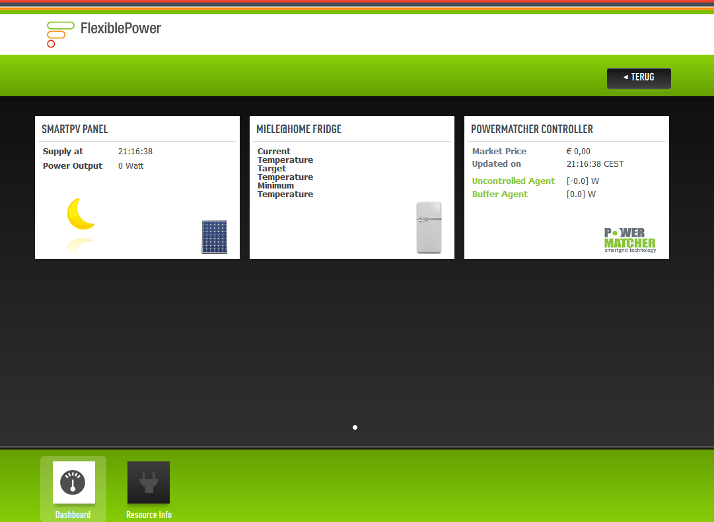

# 1. Architecture

## Introduction

Over the years a lot of different *Demand Side Management* (DSM) approaches have been developed. Unfortunately these DMS approaches are not interoperable. A similar issue can be identified on the appliance level. Appliances provide the flexibility that is being exploited by DSM. To begin with there a lot of different appliances (washing machines, Combined Heat Power Systems, PV panels, fridges, etc.). They also use different protocols for communication (Zigbee, Z-wave, WiFi, PLC, etc.).

All this variety on both the DSM and appliance level presents *Energy Management Systems* (EMS) with a big challenge. This challenge is depicted below.

Nowadays most EMS’es are tightly coupled to a particalar DSM approach. This results in a lock-in for consumers. A switch to another DSM approach/service almost always requires the installation of another EMS (hardware box).

The FlexiblePower Application Infrastructure (FPAI) aims to create an interoperable platform that is able to connect to a variety of appliances and support a host of DSM approaches. This way the EMS hardware does not need to be changed when a consumers switches from one service to another. At the same time the FlexiblePower Application Infrastructure makes it easier for service providers to introduce new services, since they do not have to provide the EMS hardware to their consumers to go with it.

## High-level design

The FlexiblePower Application Infrastructure is the connecting part between appliances at the home of the consumers at one side, and the (smart) energy grid on the other side. Appliances of different vendors can implement functionality which can be used to choose when and maybe how to start and use certain energy consuming or energy providing appliances. Developers of FPAI are responsible for providing functionality which connects these parts. Protocols are used to communicate with appliances within appliance drivers. 

The App Store and Remote Management Interface are still under development and thus not discussed in this tutorial.

For you as developer it is important to know how the infrastructure works:

* A Resource Manager receives a State from a Resource Driver. 
* This State is obtained by the Resource Driver using information sent by or polled from the appliance(s). 
* The State is converted by the Resource Manager into a Control Space. 
* The Resource Manager sends this Control Space to the Energy App. A Control Space defines the freedom in which the appliance can be started, and how much energy is consumed or produced when started. 
* The Energy App then provides an Allocation, which states when each appliance should be started, which is a time within the Control Space. 
* A Resource Manager creates Control Parameters based on this, which define when the appliance should start. The Control Parameters are sent to the Resource Driver.
* The Resource Driver actually starts the appliance.

A dashboard can show controls and information about the current state of your appliances in the form of Widgets. Each Widget shows information for an appliance. It is possible to have multiple Widgets per appliance. When run the Dashboard is currently shown at http://localhost:8080/

**Figue: Example of the dashboard. The main page of the dashboard contains widgets.**

## Components and widgets
New functionality can be installed at run-time it the form of *Apps*. An App can for example contain drivers or smart grid applications. Apps consist of one or more OSGi components. We will discuss OSGi components later on in more detail. What you need to remember for now is that the a component can have multiple instances (just like a Java class can have multiple instances called objects) and that they can be configured.

Let's consider an example configuration to demonstrate how these components can interact. In this example the FPAI is used to control a Miele refrigerator and a Miele dishwasher. We have also added the PV panel simulation to make it a bit more interesting. The PowerMatcher has been added to control these three appliances.

**Figure: Example FPAI configuration. Green blocks represent OSGi components. Click [here](https://raw.githubusercontent.com/wiki/flexiblepower/fpai-core/component_overview.png) for the full version.**

The image above shows the example configuration. All the green blocks represent OSGi components. The first line in the green blocks state the name of the component. Under the name is the configuration of the component.

Below the *Resource Abstract Layer *(RAL) we can see all the device specific components. We see that the *Miele App* provides two types of Resource Managers, two types of Resource Drivers and a Protocol Driver. The PV Panel Simulation does not have a Protocol Driver, since the simulation does not have to communicate with a device. The Pv Pavel Simulation is connected with a generic Resource Manager for uncontrolled appliances. Above the Resource Abstract Layer we can see the PowerMatcher App, which communicates with the three Resource Managers.

When you look at the the configuration of all the components you will notice that Resource Managers and Resource Drivers have a *ResourceId* property. This configuration parameter indicates which device is controlled by the components. The FPAI will automatically connect Resource Drivers and Resource Managers with the same ResourceId's. The PowerMatcher component has a configuration parameter called *ResourceIds*. This parameter contains a list of ResourceId's. The FPAI will automatically connect Resource Managers with an Energy App if the ResourceId's match.

You will also notice that there are several widgets. Every component in the system can provide a widget which is shown in the main page of the dashboard.