# Buffer/Storage Energy Flexibility Interface

This chapter explains the most complex EFI, the buffer EFI. In the first paragraph a definition is given of what a buffer is. In the second paragraph the control space is gradually introduced and explained. In the last paragraph the complete set of data elements is defined in UML.

## What is a buffer?

A buffer always has:
- A current fill level.
- An actuator to fill and/or empty the buffer
  - Which runs on one or more commodities.
  - Which has one or more running modes to define its control possibilities of a commodity in relation to the fill level of the buffer.
- Leakage from the buffer. The content of a buffer may leak when the actuators are idle.

Examples: Heat Pump with Buffer, Water pump with reservoir, MicroCHP with buffer, Battery, Electrical Vehicle, Freezer, Refrigerator, ...

## Control space

In this paragraph the buffer control space is explained in five steps, each adding new possibilities to the buffer control space.

### Buffer with running modes

The starting example of a simple buffer is a hot water buffer. The buffer can contain water with a temperature between 20 and 65 degree Celsius. The buffer has by definition a leakage discharge, in our example 0.001x/s. The buffer has a burner actuator to heat the water. This burner runs on the commodity gas and can be controlled using two running modes: off and on.

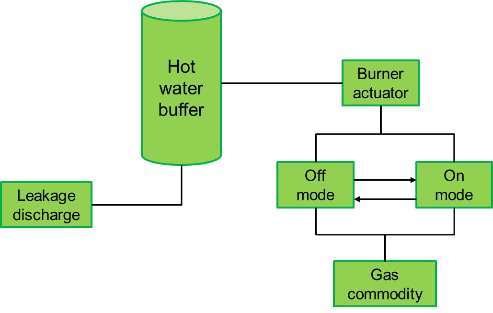

The off mode shuts down the burner, so only the leakage reduces the buffer fill level over time.
The on mode can be defined using a table specifying different possible relations between the range of x, the speed in which the buffer will be charged and the gas volume being used.

Range (x) | Charge speed (x/s) |  Gas volume (l/s)
--- | --- | ---
20-30 | 0.1 | 0.01
30-40 | 0.09 |  0.01
40-50 | 0.08 |  0.01
50-65 | 0.05 |  0.01

Note that also in the on mode, the buffer experiences leakage.

### Buffer with modulation
A bit more complex buffer does have the capabilities of heating the water using a modulation technique. The burner will use less gas but it will also take more time to get the water at a certain temperature.

To define this type of buffer an additional running mode is added, the modulation running mode. All three modes can transition into every other mode. So from off into modulation or at once into 100% on. From modulation back to off, but also up scaling to 100% on.

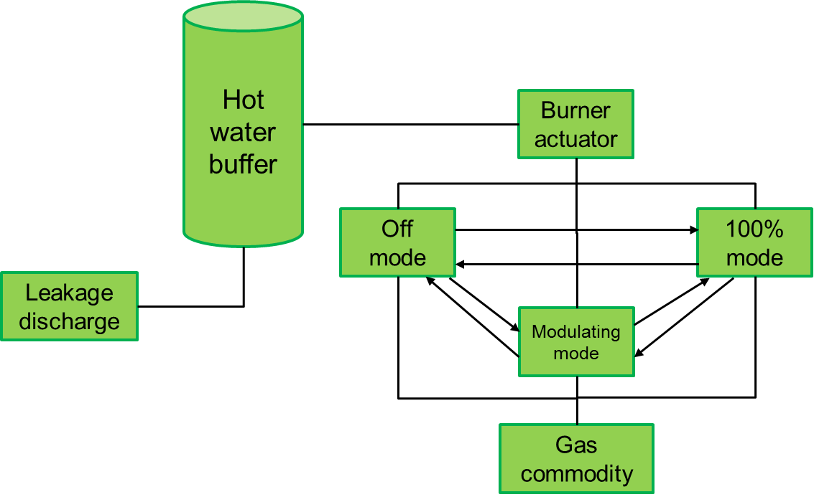

To define this, two tables are needed, one for the modulation mode and one for the 100% mode. Note that the modulation mode uses less gas, but also produces a lower charge speed.

100% running mode
Range (x) | Charge speed (x/s) |  Gas volume (l/s)
--- | --- | ---
20-30 | 0.1 | 0.01
30-40 | 0.09  | 0.01
40-50 | 0.08  | 0.01
50-65 | 0.05  | 0.01

Modulation running mode
Range (x) | Charge speed (x/s) |  Gas volume (l/s)
--- | --- | ---
20-30 | 0.05  | 0.005
30-40 | 0.045 | 0.005
40-50 | 0.04  | 0.005
50-65 | 0.025 | 0.005

### Adding forecasted usage
To help an energy app, it is very useful if it has an indication of the future usage of the buffer. Sometimes a device manager can predict this and can pass this via the buffer control space to the energy app using the usage forecast field.
When the hot water buffer is placed in a household, the usage forecast could be showers and hot water tap. Using a learning algorithm, the device manager can become better and better in forecasting the hot water tap and shower behaviour of the people living in the house.

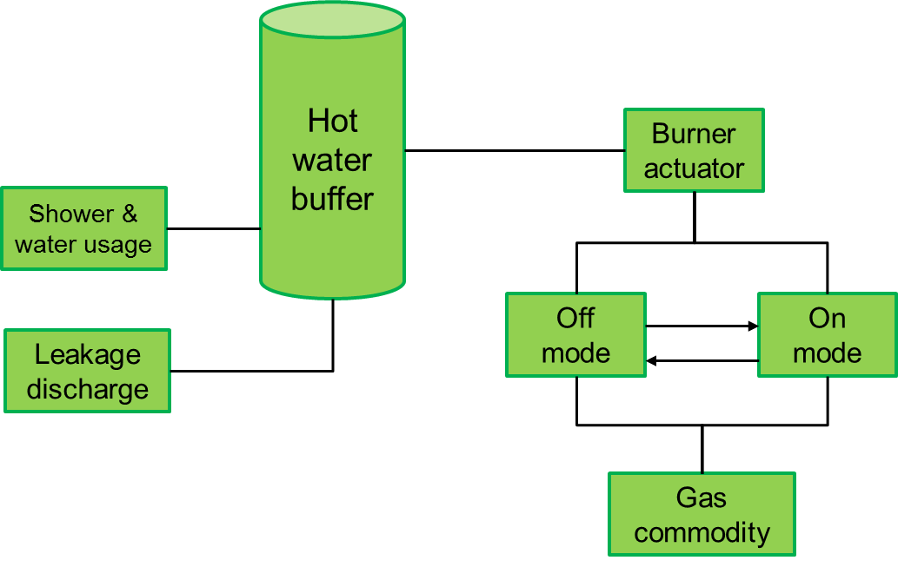

### Adding Target profile
Additionally to the forecasted usage, a device manager can also inform the energy app of a desired behaviour of the buffer. For instance the temperature of the water should be between 65°C and 75°C between 00:00 and 00:15 to prevent the legionella bacteria from occurring.

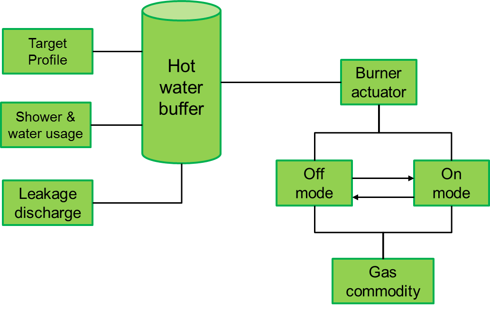

### Adding Timers
Most actuators are not build to change their behaviour very fast. When the burner is turned on, it should run some time to get a good combustion and a clean burning process. When it is turned off, the motor and buffer should give some time to cool down before starting the burner again.
To specify this behaviour the buffer control space has to option to add timers. A timer can be used to check if a transition from one running mode into another one is already acceptable. When it is, the transition can take place together with setting on or more timers.

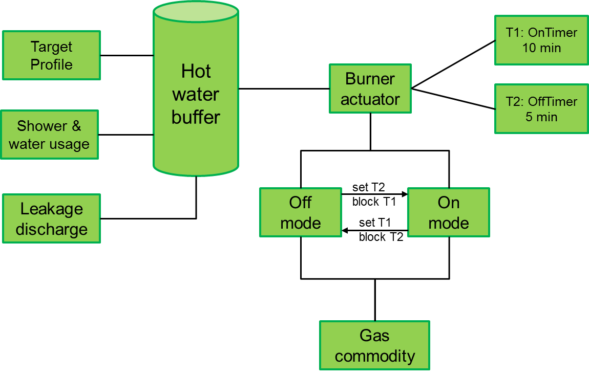

In this example there are two timers: a `onTimer` specifying the delay after which the burner may be turned on again, the minimal off time. The `offTimer` specifying the delay when the burner may be turned off, after it has been turned on, the minimal burning time.
At the transition between two running modes, the set and block field can be used to specify the desired behaviour. The block field indicates which timers must have finished before it is allowed to make this transition. These timers block the transition until they are finished. The set field indicates which timers have to be set when the transition is actually made.

### Adding more actuators
To model even more complex devices, it is possible to specify more than one actuator. Each with its own running modes and timers. The used commodities are shared between the actuators, to avoid duplicate definitions.

The behaviour of the actuators must be independent of each other. If they do influence each other’s behaviour then they should be modelled as a single actuator with a more complex set of running modes.

The only allowed influence is via the commodity. If for instance two actuators use the same commodity, in this example the commodity gas is used by the burner as well as the sterling engine, there could be set a maximum usage on the commodity. Running a single actuator at maximum capacity could result in more production than running both actuators at maximum capacity because there is not gas enough to run them both at the same time at maximum capacity.

## Data Elements
This section contains a description for each data element that parameterises the buffer EFI. The first six subsections contain a UML representation and a parameter description of the six messages: registration, system description, update, target profile, usage forecast and allocation message.

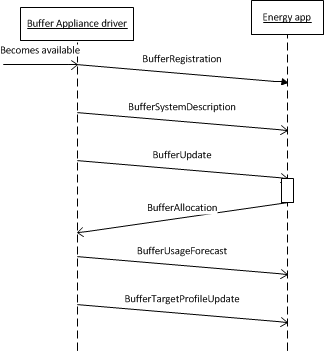
Finally examples on how to use the buffer EFI are provided.

### Buffer Control Space Registration Message

This message informs the energy app about the capabilities of this buffer appliance.

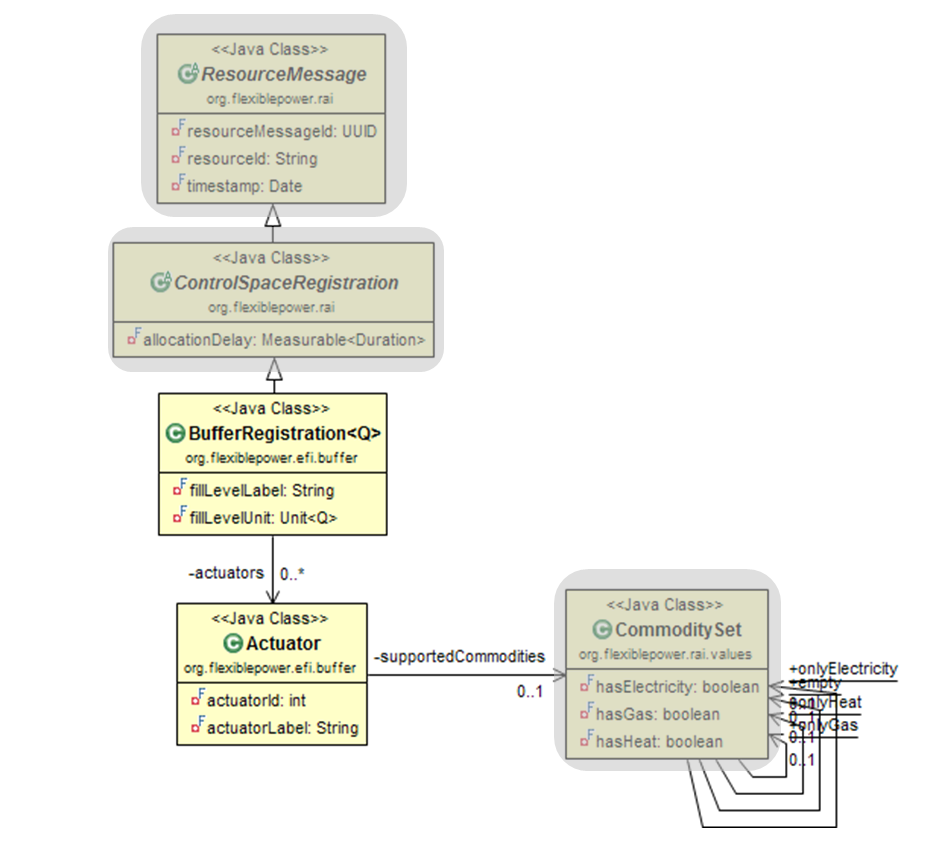

#### BufferRegistration
This class is derived from ControlSpaceRegistration and contains the registration items that are unique to a buffer.

Attribute | Description
--- | ---
`fillLevelLabel` | A label in human readable format that is being used to refer to the fill level. E.g. tap water temperature.
`fillLevelUnit` | The unit that is applicable to this buffer. E.g. degrees Celsius.
`Actuators` | This attribute is being used to express the capabilities of all the actuators this buffer appliance has. E.g. a gas burner and a Stirling engine.

*Table 28: The attributes of the `BufferRegistration` class*

#### Actuator
This class describes the capabilities of an actuator within an appliance of the buffer category.

Attribute | Description
--- | ---
`actuatorId` | A unique identifier for this actuator. The identifier only has to be unique within the context of the appliance, therefore a simple integer suffices.
`actuatorLabel` | A human readable label for this actuator. E.g. Stirling engine.
`supportedCommodities` | This attribute contains information on the commodities that can be produced or consumed by the appliance. It is of the type `CommoditySet`.

*Table 29: The attributes of the `ActuatorCapabilities` class*

### Buffer System Description Message
This message describes the different running modes and their effect to the buffer appliance.

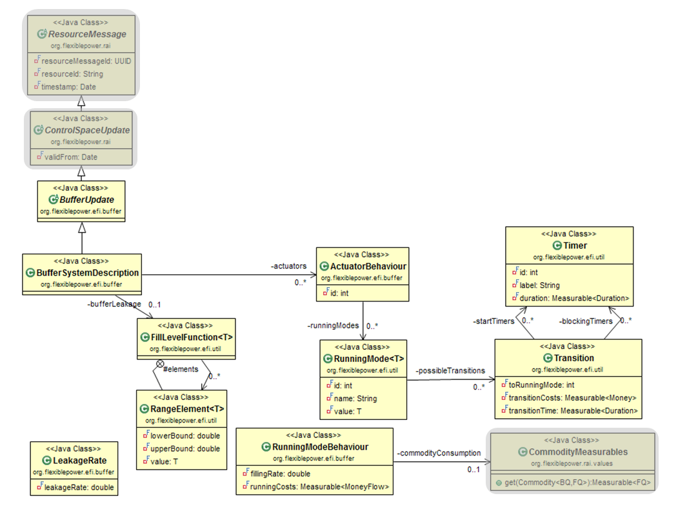

#### BufferUpdate

This class is derived from `ControlSpaceUpdate` and is used to bundle all updates from an appliance of the buffer category.

It does not have any additional attributes.

#### BufferSystemDescription

This class is derived from `BufferUpdate` and contains the actuators and the buffer leakage information.

Attribute | Description
--- | ---
`bufferLeakage` | This attribute contains all the information on the leakage of this buffer.
`actuators` | This is a list of zero or more actuators which describes the behaviour of these actuators.

*Table 30: The attributes of the `BufferSystemDescription` class*

#### FillLevelFunction<T>
This class approximates a function where the value is dependent on the fill level of the buffer. It implements a list of `RangeElement<T>` objects and can be used in that manner.

Attribute | Description
--- | ---
`elements` | The fill level function is approximated by a table. An element corresponds to a table row.

*Table 31: The attributes of the `FillLevelFunction` class*

#### RangeElement<T>
This class contains a value that corresponds to a certain range of the `FillLevelFunction<T>`. The type with which the `FillLevelFunction<T>` is parameterized is being used as a parameter for `RangeElement<T>` and is the type of the value attribute.

Attribute | Description
--- | ---
`lowerBound` | The lower bound of this range. The value of lower bound corresponds to the fill level.
`upperBound` | The upper bound of this range. The value of upper bound corresponds to the fill level.
`value` | This attribute can hold a value for this element of any type. This type is passed on as a parameter for this class.

*Table 32: The attributes of the `RangeElement` class*

#### LeakageRate

In order to describe buffer leakage this class is being used as a parameter for `FillLevelFunction<T>` so that `FillLevelFunction.RangeElement.value` is of the type LeakageRate. It expresses the leakage amount per second.

Attribute | Description
--- | ---
`leakageRate` | This attribute expresses the leakage amount per second for this buffer in a certain range. The `leakageRate` value has to be subtracted from the combined applicable `RunningModeBehaviour.fillingRate` values to obtain the net filling rate of this buffer.

*Table 33: The attributes of the `LeakageRate` class*

#### ActuatorBehaviour

This class describes how an actuator can affect the buffer.

Attribute | Description
--- | ---
`id` | A unique identifier (within the context of this buffer) for this actuator.
`runningModes` | A list of zero or more possible running modes for this actuator.

*Table 34: The attributes of the Actuator class*

#### RunningMode<T>
This class is both being used for the Buffer and Unconstrained (see chapter 6) category. The difference lies in the parameter that is being passed on to this class. In the case of the Buffer category it is parameterized with the `FillLevelFunction<RunningModeBehaviour>` class.

Attribute | Description
--- | ---
`id` | A unique identifier (within the context of this buffer or unconstrained appliance) for this running mode.
`name` | A human readable name for this running mode. E.g. “full power”.
`possibleTransitions` | A list of zero or more Transition objects that contain constraints for switching from this RunningMode to another.

*Table 35: The attributes of the `RunningMode` class*

#### RunningModeBehaviour

In order to describe the behaviour of a RunningMode this class is being used as a parameter for ` FillLevelFunction<T>` so that `FillLevelFunction.RangeElement.value` is of the type  `RunningModeBehaviour`. It expresses the fill amount per second of the buffer and the corresponding flow rates of the commodities involved.

Attribute | Description
--- | ---
`fillingRate` | This attribute expresses the amount per second with which this actuator fills the buffer. It can also be used to express the emptying of the buffer in which case the fillingRate will take on a negative value.
`runningCosts` | Running a buffer device may cause wear. The deprecation costs for running this mode may be expressed by this attribute.
`commodityConsumption` | This attribute contains the flow rate of all commodities that are involved in this `RunningModeBehaviour`. In the case of consumption this flowrate will be positive, it will be negative in the case of production.

*Table 36: The attributes of the `RunningModeRangeElement` class*

#### Transition
This class contains the constraints for switching from one `RunningMode` to another.

Attribute | Description
--- | ---
`toRunningMode` | When making this transition this attribute holds the id of the new RunningMode.
`blockingTimers` | This is a set of zero or more Timer objects.  All these timers have to be finished before the transition can be made.
`startTimers` | This is a set of zero or more Timer objects. All these timers have to be started when this transition is made. E.g. when an actuator is being switched on, the “on” timer has to start to make sure that the actuator will adhere to the correct minimum “on” time before switching off again.
`transitionCosts` | It could be that the transition itself will cause wear to the actuator. The deprecation costs associated with this transition may be expressed by this attribute.
`transitionTime` | In some cases a transition will not happen instantly. This attribute specifies the period of time needed for going from one RunningMode to another (e.g. ramping up or down). It is important to note that all timers are started at the beginning of the transition and not at its completion.

*Table 37: The attributes of the `Transition` class*

####  Timer
The timers are used as constraints for transitions.

Attribute | Description
--- | ---
`id` | A unique identifiers for this timer within the context of an `Actuator`.
`label` | A human readable label for this timer. E.g. “on” timer.
`duration` | The (minimal) period of time that has to be respected before this timer is finished.

*Table 38: The attributes of the `Timer` class*

#### Buffer State Update Message
The System Description Message describes the behaviour of the buffer appliance. In order to make informed decisions on how to use the buffer one also needs to know its current state. This is communicated by this message.

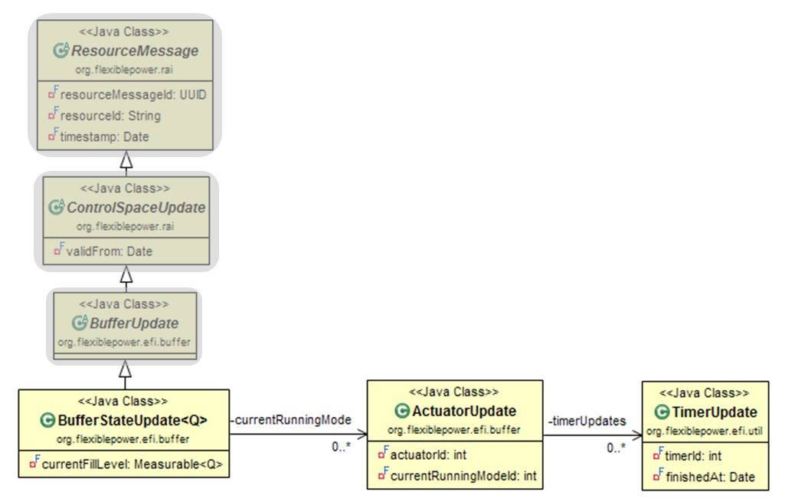

#### BufferStateUpdate
This class contains up to date information about the state of the buffer.

Attribute | Description
--- | ---
`currentFillLevel` | This value represents the current fill level of the buffer.
`currentRunningMode` | This is a set of zero or more current running modes. For every actuator there will be one current running mode.

*Table 39: The attributes of the `BufferStateUpdate` class*

#### ActuatorUpdate
This class contains up to date information about the state of an actuator.

Attribute | Description
--- | ---
`actuatorId` | This id refers uniquely to an actuator in this buffer appliance.
`currentRunningModeId` | This id refers uniquely to the current running mode of the actuator that is referred to in this update.
`timerUpdates` | A set of zero or more `TimerUpdate` objects.

*Table 40: The attributes of the `ActuatorUpdate` class*

#### TimerUpdate
This class contains up to date information about the state of the timers.

Attribute | Description
--- | ---
`timerId` | This id refers uniquely to a timer that is associated to an actuator within a buffer appliance.
`finishedAt` | The timestamp that indicates when this timer will be finished.

*Table 41: The attributes of the `TimerUpdate` class*

### Buffer Target Profile Message
This message is being used to communicate a target profile that has to be met by this buffer. The target profile describes the boundaries that the internal buffer quantity should respect for a specific period in time. It is important to stress that a new target profile message completely overrules a previous one.

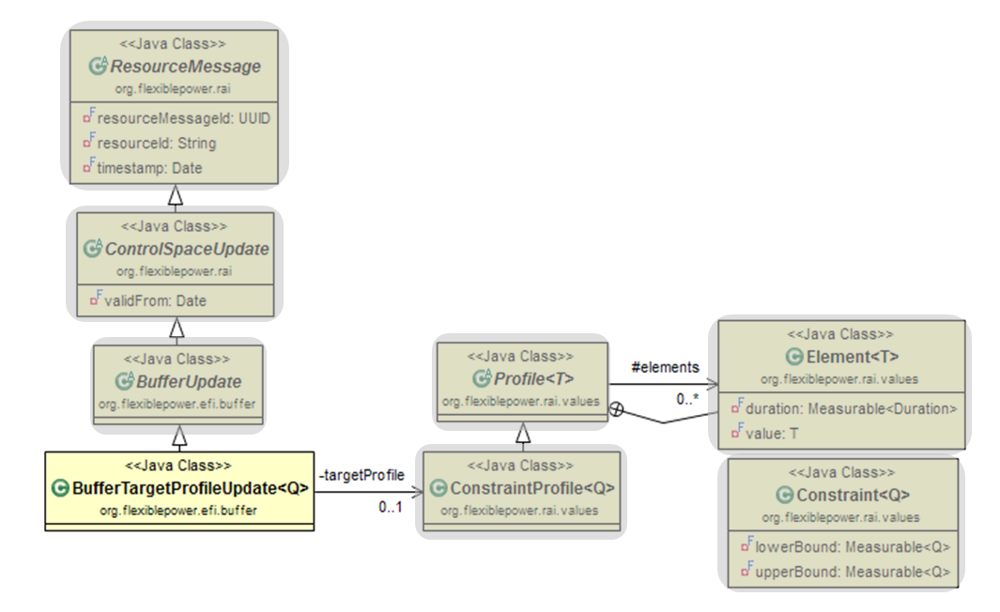

#### BufferTargetProfileUpdate
This class is derived from BufferUpdate and contains the target profile for this buffer. The start time for this target profile is ControlSpaceUpdate.validFrom.

Attribute | Description
--- | ---
`targetProfile` | The actual target profile that should be met by this buffer.

*Table 42: The attributes of the `BufferTargetProfileUpdate` class*

### Buffer Usage Forecast Message

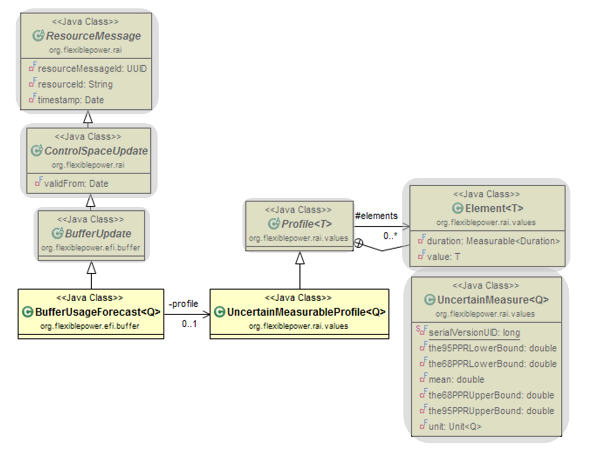

#### BufferUsageForecast
This class is derived from `BufferUpdate` and contains the forecasted usage for this buffer. The start time for this forecast is `ControlSpaceUpdate.validFrom`.

Attribute | Description
--- | ---
`profile` | The actual forecast profile for this buffer.

*Table 43: The attributes of the BufferUsageForecast class*

#### UncertainMeasurableProfile
This class is derived from `Profile` and is parameterized with `UncertainMeasure`. This ensures that it can be verified that this profile only contains elements of the `UncertainMeasure` class.

It has no additional attributes.

### Buffer Allocation Message

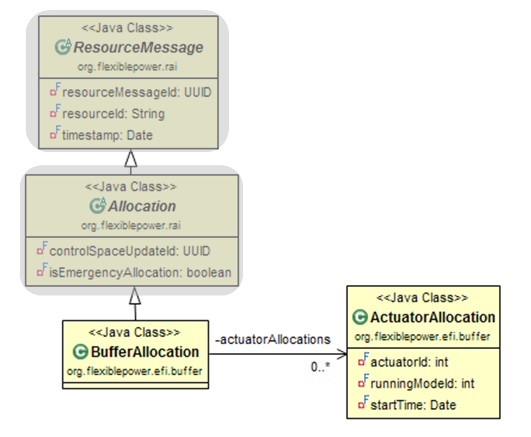

#### BufferAllocation
This class is derived from `Allocation` and contains specific allocation information for a buffer appliance.

Attribute | Description
--- | ---
`actuatorAllocations` | A set of zero or more `ActuatorAllocation` objects.

*Table 44: The attributes of the `BufferAllocation` class*

#### ActuatorAllocation
This class contains allocation information for a specific actuator at a specific time.

Attribute | Description
--- | ---
`actuatorId` | An id that uniquely refers to an actuator within the buffer appliance.
`runningModeId` | An id that uniquely refers to a running mode for this actuator. The actuator has to start this running mode.
`startTime` | The start time for the running mode that is referred to in this actuator allocation.

*Table 45: The attributes of the `ActuatorAllocation` class*
