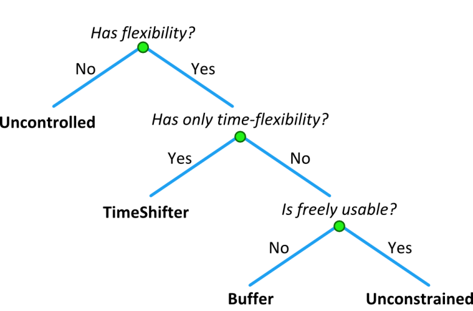

# 1.2. Control Spaces

## Abstraction into Control Spaces
When putting appliances in generic models, it is our experience that there are four classes into which all appliances fit. Table 1 briefly showed these four classes and in the next sections these classes are explained in more detail.
### Uncontrollable Control Spaces
Uncontrollable control spaces are those that cannot be controlled and therefore cannot be used in a flexible manner. This applies in particular to the renewable energy sources, such as PV panels and wind turbines. But also to inflexible part of  domestic loads, i.e. TV set, indoor lighting, coffee machine, etc.

Renewable energy sources depend on conditions in nature for their energy production. The amount of solar radiation determines the energy production for PV and the wind force does the same for wind turbines. These elements of nature cannot be curtailed and hence the Uncontrollable Control Space.

Within a domestic environment, there are several components which realistically cannot be controlled. One would not like to be denied access to one’s TV set if congestion management demands for less energy. The same hold true with coffee machines, water cookers, etc. The end users determines the usage and not the system. Hence the Uncontrollable Control Space.
#### Uncontrollable allocations
Although most uncontrollable appliances are exactly what their name implies, there are some instances of uncontrollable appliance that actually can be controlled in a limited way.

E.g. a PV inverter might be controlled to curtail its power output so that it will never produce more than a certain predefined limit. This can be useful to prevent peaks on the electricity grid. In that case the allocation will communicate the maximum amount of production or consumption that an uncontrolled appliance is allowed to.

### Time Shiftable Control Spaces

Where the uncontrollable control space cannot be controlled, the Time Shiftable Control Space can. The usage patterns of time shiftable devices allows for usage shifting in time. It is not about using an appliance less, but rather using it at different moments in time. Examples of such devices are washing machines and dishwashers. Both need to run at some time to either clean clothing or dishes. The exact time at which this is done is not that important. This method introduces flexibility in the electrical system by moving the usage of electrical energy in time. If the electrical system needs less consumption, the running of these devices can postponed to be better suiting moment. Once the device starts working, it performs its normal operation and cannot be controlled anymore.

Another characteristic of this class of devices is that there is a need to be finished before a fixed time. The dished need to be clean and dry before breakfast next morning. This deadline must be adhered to, even if it goes against the needs of the electrical system.

#### Timeshiftable Allocation

The flexibility of this category consists of shifting the start time to a moment that is most optimal. Therefore the allocation consists of simply sending the desired start time for this appliance.

### Buffer and Storage Control Spaces

Some appliances have flexibility in the form of a buffer. The Control Space lists the flexibility in either production or consumption of energy that is available between the minimum and maximum fill level of the buffer. The usage is not shifted in time, rather its usage is altered in time to provide an optimum solution.

Energy can be stored electrically, in which case it is a battery. Another example of energy storage is storing it as heat or cold.  A refrigerator or freezer stores cold and when it warms up, one can say the buffer is slowly emptied. At a certain predefined point, i.e. temperature, the refrigerator or freezer will turn on and start cooling again, i.e. filling the buffer again. This filling does not need to be done at exactly the same temperature each time. It can be done a little sooner or later, depending on the current state of the electrical system. Of course, if the temperature rises too high, then there is no flexibility anymore and the appliance must be turned on.

For storing heat, either a heat pump or a Combined Heat and Power (CHP) in combination with a water buffer is used. The water is heated and used for space heating or tap water. The state of the water buffer determines the amount flexibility that is offered. The difference between the two devices is that heat pumps use electrical energy for producing heat, while an CHP uses gas to generate heat and produces electricity. A CHP is a multi-commodity device, because it uses gas and produces electricity.

Just as heat and cold are stored in buffers, so is electrical energy. This is a battery of course. It too fits within the Buffer and Storage Control Space and is governed much the same as with heat and cold. The Electrical Vehicle (EV) is not much different from a battery when it is used in Vehicle to Grid  (V2G) scenarios. The exception is that where a battery is usually stationary, the EV will change location and its State Of Charge (SoC) can change unpredictably when is reconnects to the electrical system.

#### Buffer and Storage Allocations

A buffer or storage appliance has multiple modes that it can be in, e.g.: switched on, switched off, different modulations. The allocation states which mode the appliance has to switch to, at what time.

### Unconstrained Control Spaces

All discussed control spaces thus far have been constrained in one way or another. The Unconstrained Control Spaces have no such restrictions. The Control Space lists the flexibility in either production or consumption of energy without being bound to a buffer or deadline.

Unconstrained Control Spaces are much like Buffer or Storage Control Spaces, but without a buffer. A generator is such an example. It can be switched on in order to provide extra power to the electrical system and can be switched off when the need has dissipated. There are only technical device constraints when it can or cannot run, such as the amount of diesel it has left, how fast the generator may be started again after it has been stopped, etc.

#### Unconstrained Allocations

The allocation of unconstrained appliances is similar to that of buffer and storage appliances.

## Which category to use?

The previous section described the four different types of Control Spaces. A question that might arise is on how to decide what Control Space is suitable for which appliance or device? This will lead to a decision tree as depicted in Figure 2. The first question that must be answered about the device is: has it any form of flexibility in it? If it does not, from the flexibility point of view, there is no desire to control it and hence the Uncontrolled Control Space.

In case the appliance does have flexibility to offer, it can do so in different forms. The first one is if the usage of the appliance can be shifted in time and there is a deadline before the device must be finished. If it can and does, the TimeShifter Control Space is appropriate. You do not change the behaviour of the appliance, rather you change the moment at which the appliance is switch on and off.

When the full operation of the device cannot be shifted in time, then it might be that there are constrains on the device, such as a buffer. Asking the question if the appliance is freely usable, yields the Buffer Control Space in case it is not and if the answer is yes, yields in the Unconstrained Control Space.

