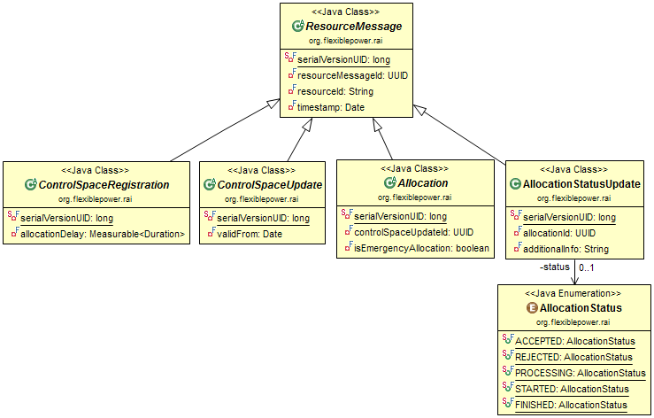

# Resource Abstraction Interface

The core functionality of the FPAI is the ability to express [../Architecture#high-level-design](energy flexibility) in a reusable manner. The current implementation of called the [../EnergyFlexibilityInterface](EFI) and should be used directly. But to be able to update the EFI in the future or even to make other abstractions possible (e.g. for home automation), the RAI defines a generic set of messages that define the communication.

The following image shows the generic type of messages in the RAI.

* Figure: Overview of the resource messages between the Application driver and the Energy app *

The figure below provides an overview of all the communication classes in the Resource Abstraction Interface. All Energy 
Flexibility Interface messages have been derived from one of these communication classes. The parent class of all messages is 
the `ResourceMessage` class.

* Figure: Overview of the communication classes of the RAI *

The classes are described in the following sections.

## ResourceMessage
A parent class from which all more specific messages are derived.

Attribute | Description
--- | ---
resourceMessageId | An identifier that uniquely identifies this message object.
resourceId | An identifier that uniquely identifies the resource (more specifically appliance/device, in the case of EFI) that this message contains information about.
timestamp | This timestamp indicates the moment in time this message was constructed.

*Table 2: The attributes of the ResourceMessage class*

### Controlspace Registration
As soon as an appliance becomes available to an energy app (a term that is used interchangeably with “Smart Grid Application� from Figure 1), it will send a `ControlSpaceRegistration` message. This message is used to inform the energy app about the capabilities of the appliance.

Each of the ControlSpace categories introduced in Table 1 will have its own registration class that is derived from this one. Attributes about specific capabilities are added in the derived messages and are defined in the next chapters.

Attribute | Description
--- | ---
allocationDelay | In response to a `ControlSpaceUpdate` an `Allocation` may be sent. It could very well be that the processing of the `Allocation` requires a certain period of time. It is this period that is indicated by the allocationDelay attribute.

*Table 3:  The attributes of the ControlSpaceRegistration class*

### ControlSpaceUpdate
This message contains information about the flexibility an appliance has to offer.

Just like the `ControlSpaceRegistration` message, each of the `ControlSpace` categories introduced in Table 1 will have its own update class or classes that are derived from this `ControlSpaceUpdate` message.

Attribute | Description
--- | ---
validFrom | This timestamp indicates from which moment on this update is valid.

*Table 4: The attributes of the ControlSpaceUpdate class*

### Allocation
An Allocation message is always a response from the energy app to a `ControlSpaceUpdate` message. It contains instructions on how to use (or fix) the flexibility described in the `ControlSpaceUpdate`.

Again, each `ControlSpace` category has its own `Allocation` message that is derived from this one.

Attribute | Description
--- | ---
controlSpaceUpdateId | An identifier that uniquely identifies the `ControlSpaceUpdate` message that this message is a response to.
isEmergencyAllocation | This `Boolean` value is optional and is true when a grid emergency situation occurs. (e.g. congestion, black start etc.) The energy app then strongly advices the appliance driver to adapt to the sent allocation in order to maintain grid stability.

*Table 5: The attributes of the `Allocation` class*

### AllocationStatusUpdate
After an appliance driver received an `Allocation` message, it is good practice to provide feedback to the energy app on the follow up actions. This can be done via this message.

All ControlSpace categories use this `AllocationStatusUpdate` message; there are no specific derivations in use.

Attribute | Description
--- | ---
allocationId | An identifier that uniquely identifies the Allocation message that this update refers to (the Allocation.resourceid).
status  This attribute indicates the current status of the Allocation. It assumes one of the values specified in the AllocationStatus enumeration (see Table 7).
additionalInfo | In addition to the status attribute additional and more specific information can be expressed in a human readable format.

*Table 6: The attributes of the `AllocationStatusUpdate` class*

### AllocationStatus
This enumeration contains all possible states that may be fed back by an appliance driver to an energy app in response to an `Allocation`. Figure 5 shows the five states the allocation status can be. In the table below the states are explained.

Enumeration | Description
--- | ---
ACCEPTED | The appliance driver has accepted the Allocation, meaning that it will try to follow the instructions from the Allocation message as closely as possible.
REJECTED | The driver is not able or willing to follow up the instructions.
PROCESSING | The driver has not yet started but is processing the instructions in order to be able to start on time. Once the PROCESSING state has begun it is not possible anymore for the energy app to send a new Allocation message to overrule a previous one. This PROCESSING state corresponds with the allocationDelay attribute of the `ControlSpaceUpdate` message. This state is optional: it is allowed to go from the Accepted state directly to the Started state, if no processing time is needed.
STARTED |The driver has started the Allocation of the energy app.
FINISHED | When the Allocation has been completed, the appliance driver will inform the energy app by sending a finished event.

*Table 7: The values of the AllocationStatus enumeration*

## Revocation of Control Spaces and Allocations

When an energy app or an appliance driver decides to revoke its sent allocation or control space update the `AllocationRevoke` and `ControlSpaceRevoke` messages can be used. The figure below provides an overview of the revoke classes.

### Control Space Revocation
An appliance driver can revoke an already sent `ControlSpaceUpdate` message by sending the `ControlSpaceRevoke` message. After sending the message every received `ControlSpaceUpdate` should be removed by the energy app, only the registration message is valid afterwards.

### Allocation Revocation
An energy app can revoke sent allocations by sending the `AllocationRevoke` message. After sending the message all the received `Allocation`s should be removed by the appliance driver. The appliance driver should sent a new `ControlSpaceUpdate` message to get an allocation to work with.

## Commodities
Previously only the electrical consumption and/or production of an appliance existed. However, in addition to electricity, it also very useful to look at the gas consumption, in the case of a CHP for instance. Gas and electricity are generically referred to as commodities within EFI.

Of course one can also think of other commodities such as heat, CO2 emissions or water. Within EFI it is very easy to define additional commodities if required. However to prevent unclarity (towards appliance drivers and energy apps) as to which commodities are supported, each version of EFI comes with a fixed set of commodities.

This version supports electricity, gas and heat as depicted in the next figure. The Java class contains to static declarations of the Commodity class. One for `Electricity` with as `billableUnit` kWh and as `flowUnit` W. And one for gas with as `billableUnit` `Cubic_Metres_per_Second`  and as `flowUnit` `Cubic_Metre`.

### Commodity
This abstract class contains information about the units that are used for a particular commodity. There are currently implementations for the commodities ELECTRICITY, GAS and HEAT.

Attributes | Description
--- | ---
billableUnit | The unit that is used for billing purposes. E.g. for electricity this is kWh, for gas m3 is used. There will be helper methods to transform the flowUnit into billableUnit.
flowUnit | The unit that indicates the rate at which a commodity is being consumed or produced. E.g. for electricity this would be power expressed in the watt unit (W), for gas m3/s is used.

*Table 8: The attributes of the Commodity class*

### Commodity Profile
Quite often there is a need to describe an energy pattern; the consumption or production of energy over time. An example would be the energy production of a PV panel over the last two hours or the energy consumption of a washing machine program. These energy patterns are expressed in the so called commodity profiles. These are being used across multiple appliance categories.

A explained above, the commodity profile describes the consumption of a certain commodity over time. Figure 8 depicts an example of a commodity profile. The y-axis represents the flow unit amount of the commodity and the x-axis represents time. The profile comprises one or more bins (implemented as profile element 2.4.2) with a duration tx and a certain volume of commodity.

### Profile
Throughout this specification different profile types are being used. These profiles are all derived from this generic `Profile` class.

Attributes | Description
--- | ---
elements | A profile contains zero or more profile elements.

*Table 9: The attributes of the Profile class*

### Element
This class represents each element in the profile, an element always has a certain duration and a value. The type of this value can be anything.

Attributes | Description
--- | ---
duration | Specifies the duration of this element and is expressed as the number of seconds.
value | Specifies the value of this attribute. The type of this value is templated and can take on any form.

*Table 10: The attributes of the Element class.*

### CommodityProfile
This class is derived from `Profile`. In the case of a `CommodityProfile`, all `Element.value` attributes should be of the type `CommodityMeasurables`. This constraint is not visible in the UML diagram, but is ensured via `Builder` classes.

`CommodityProfile` does not have any additional attributes.

### CommodityMeasurables
The underlying structure of this class is a map of commodities and measurables. The choice was made not to have a separate `Profile` for each `Commodity`, but rather to have a single `Profile` where each `Element` can contain multiple values; one for each `Commodity`.

This `CommodityMeasurables` class provides access to these values - expressed as a `Measurable<FQ>` object - for multiple commodities. It provides a get method that returns a `Measurable<FQ>` object, using the `Commodity<BQ,FQ>` of interest as an argument.

Method | Description
--- | ---
`get(Commodity<BQ,FQ>)`: `Measurable<FQ>`` This method returns the value of a particular commodity as a `Measurable<FQ>` object. The `Commodity<BQ,FQ>` of interest is given as an argument.

*Table 11: The methods of the `CommodityMeasurables` class*

## Commodity forecast
The commodity forecast profile is quite similar to the commodity profile, but as it name implies it contains information about future events. In addition to the commodity profile, the forecast is also able to express uncertainty. This uncertainty applies both to the duration and the amount of a bin in the forecast.

### CommodityForecast
This class is derived from Profile. In the case of a CommodityForecast, all Element.value attributes should be of the type CommodityUncertainMeasurables. This constraint is not visible in the UML diagram but is ensured via Builder classes.

CommodityForecast does not have any additional attributes.

### CommodityUncertainMeasurables
The underlying structure of this class is a map of commodities and uncertain measures. The choice was made not to have a separate Profile for each Commodity, but rather to have a single Profile where each Element can contain multiple values; one for each Commodity.

This CommodityUncertainMeasurables class provides access to these values - expressed as a UncertainMeasure<FQ> object - for multiple commodities. It provides a get method that returns a UncertainMeasure<FQ> object, using the Commodity<BQ,FQ> of interest as an argument.

Method | Description
--- | ---
get(Commodity<BQ,FQ>): UncertainMeasure<FQ> | This method returns the value of a particular commodity as a UncertainMeasure<FQ> object. The Commodity<BQ,FQ> of interest is given as an argument.

*Table 12: The attributes of the CommodityUncertainMeasurables class*

### UncertainMeasure
This class is being used to express uncertainty about a value. In most cases one would choose a normal or Gaussian distribution and specify the mean (μ) and the standard deviation (σ), whereby 68% of the range would fall within μ ± σ and 95% within μ ± 2σ. However a Gaussian distribution is not always the correct one to use, because a distribution may also be asymmetric. Consider a PV panel on a cloudy day for instance. It will be most likely that the PV panel will not produce any or only very little energy. The chance that a significant amount of energy will be produced is very small. Therefore the centre of gravity of this distribution will be around zero, yet it will not extend below zero, since the PV panel will never consume energy.

The PV panel example underlines the need to support different distributions. One way of doing this would be to explicitly specify the distribution type that is being used. However that implies that both sides need to be aware of the full set of possible distribution types.

Another way of handling this problem is to not specify a particular distribution at all. Instead UncertainMeasure provides the mean value as well as the ranges in which 68 and 95 percent of the values fall. For both ranges a lower and upper bound is given. This flexible solution also allows the expression of asymmetric distributions as described in the PV panel example.

Attributes | Description
--- | ---
mean | Specifies the mean value.
the68pprLowerBound | The lower bound of the 68 percent range.
the68pprUpperBound | The upper bound of the 68 percent range.
the95pprLowerBound | The lower bound of the 95 percent range.
the95pprUpperBound | The upper bound of the 95 percent range.
unit | The unit for this value.

