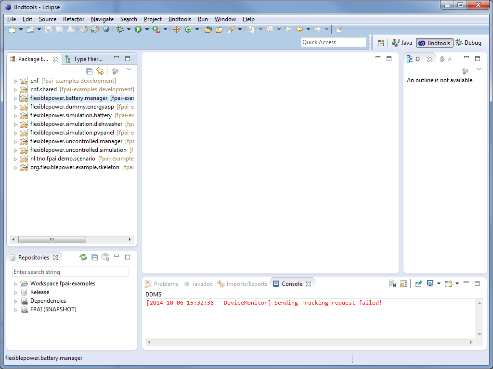
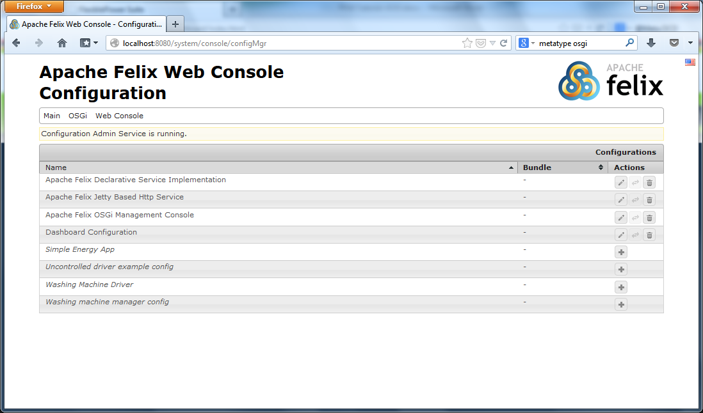

# OSGi, Bndtools and the Felix Web Console


** Figure: where OSGi comes in compared to Java **

OSGi (Open Service Gateway initiative) is a specification for a service platform that enables a dynamic component model in Java. This means it is a layer on top of Java, that makes it possible to register and use bundles of modules and services. This makes separation of responsibilities easy and allows for separation of the API and it's implementation in compiled packages.

This page briefly describes all the necessary concepts which are required to start developing for the FPAI. There are of course other resources which describe OSGi in much more detail.

The FPAI runs on top of the Apache Felix OSGi framework. For developing we recommend using the Apache Felix Web Console. For development we use Eclipse in combination with Bndtools.

## Your workspace
If you followed the steps in [[Setting up your IDE|SettingUpYourIDE]], you should now have Eclipse with the Bndtools perspective.



**Figure: Eclipse with the Bndtools perspective**

You will notice that there are several views (part of the user interface). You can reorganize these views as you like.

**Package Explorer**
In the package explorer you see your packages. These contain you normal `src and `test` folders, but with a few extra's, of which the most important is the bnd.bnd file. This typically contains:
- buildpath
- Bundle-Version: a version number
- Export-Package: which packages are visible to other bundles
- Service-Component: where to look for components for the service registry
- Private-Package: which packages are for use within this bundle only.

An example from `flexiblepower.simulation.pvpanel`:

```
-buildpath:  \
  ${default-buildpath},\
  javax.servlet;version='latest',\
  org.apache.felix.scr

Bundle-Version: 2.0.0.${qualifier}
Export-Package: org.flexiblepower.simulation.pvpanel
Service-Component: org.flexiblepower.simulation.pvpanel.*
```

## Bundles
Bundles are the building blocks of OSGi. A bndtools project in eclipse typically compiles to a bundle. A bundle is a group of Java classes and additional resources equipped with an added detailed manifest, which is automatically added to compiled jar files by bndtools.

## Services
A bundle can provide several services. The services layer connects bundles in a dynamic way, so they are started either immediately or when needed by another component.

Services are provided using the Services Registry, the API for manageming services. It consists of ServiceRegistration, ServiceTracker and ServiceReference.

OSGi already has a lot of built in services, which are included in the runtime, for instance Configuration Admin, Logging, and User Admin.

## Bndtools
In the [[Previous Chapter|SettingUpYourIDE]] you have installed Bndtools. Bndtools has no other requirements than Eclipse itself. It offers you an easy, powerful and productive way to develop with OSGi. Bndtools uses bytecode analysis to accurately calculate the dependencies of your OSGi bundles. In the tutorial we will further explain how to use Bndtools.

## Component model

## Bnd Repositories
Bndtools features a pluggable repository model for bundles, that may be referenced at build-time and also used to satisfy runtime dependencies. In eclipse it shows a Repositories view, which shows which bundles are available for your convienience. Bndtools automatically calculates imports and resolves dependensies using the repositories.

## Running the FPAI
FPAI can be run from Eclipse using a `.bndrun` file, typically placed in the `cnf` folder. It is advised to have a `bndrun` file for each use case, e.g. running all integration tests, just testing your new code or running only the core. In the `bndrun` file you specify which framework to use, the Java EE version, and most importantly, which bundles are required to run under Run Requirements. Bndtools then can resolve which bundles are needed in run bundles. Make sure you add all the required bundles under Run Requirements and make sure it resolves, or else running FPAI will fail.

## The Apache Felix Web Console

Apache Felix has a web console, which can be found at http://localhost:8080/system/console/bundles/ . The default username and password are admin. Inside the web console, under  you can see which bundles are running and you can add configurations. Most of the time you will have to add a configuration in order to make a bundle run (otherwise it will be registered, but not active). This is also the case when a bundle is available, but not used anywhere. If a bunle has unsatisfied dependensies, it is shown as unsatisfied.

Next up is the [[Tutorial|Tutorial]]