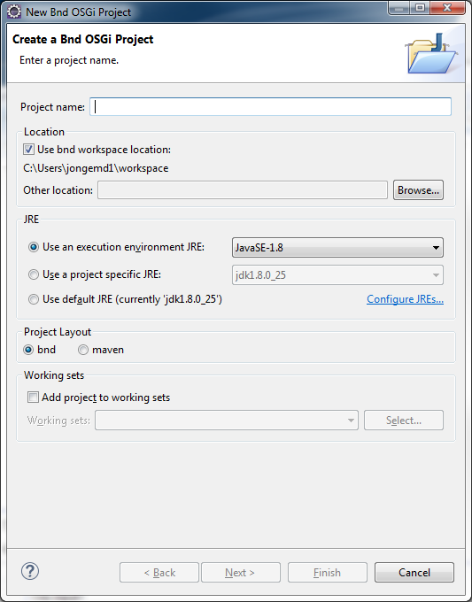
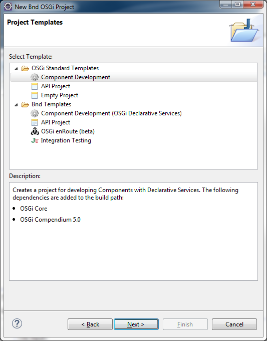
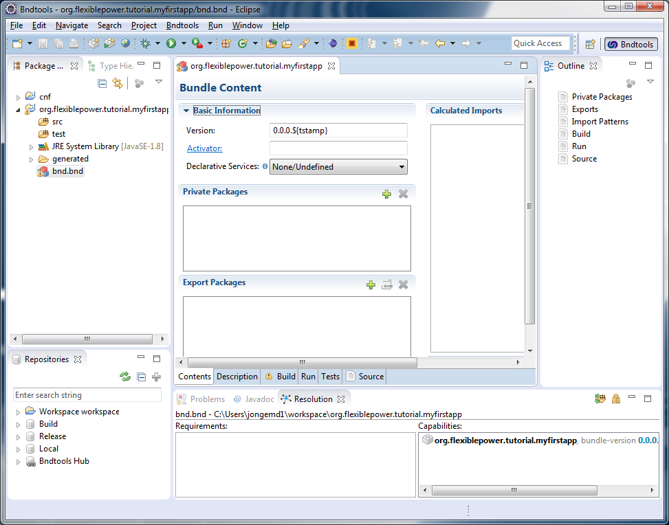
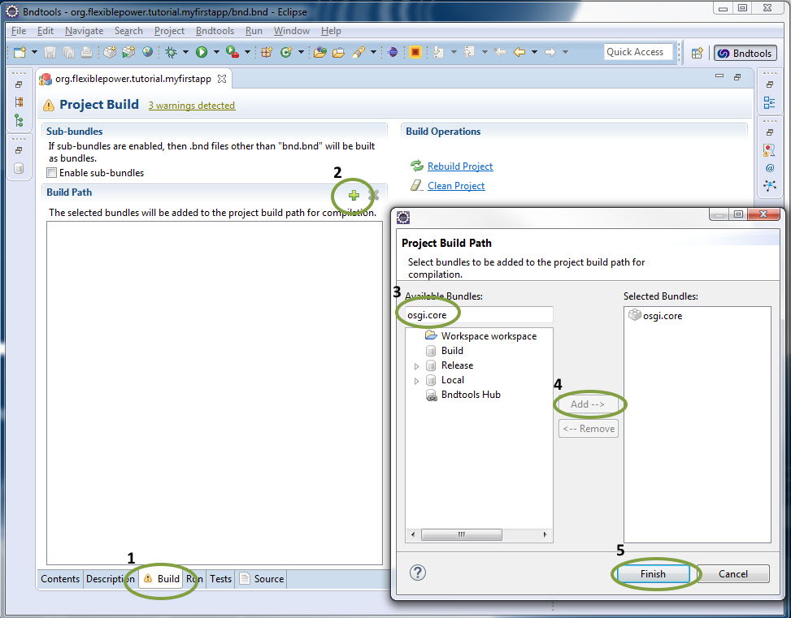
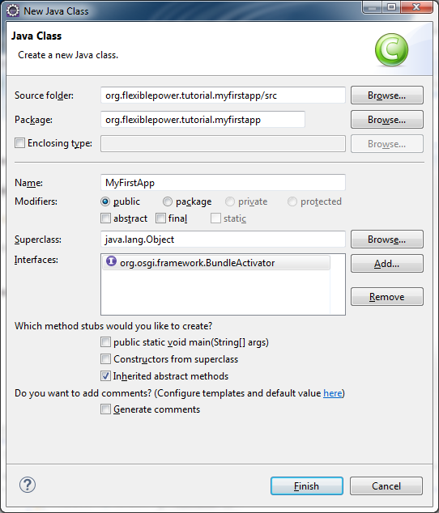
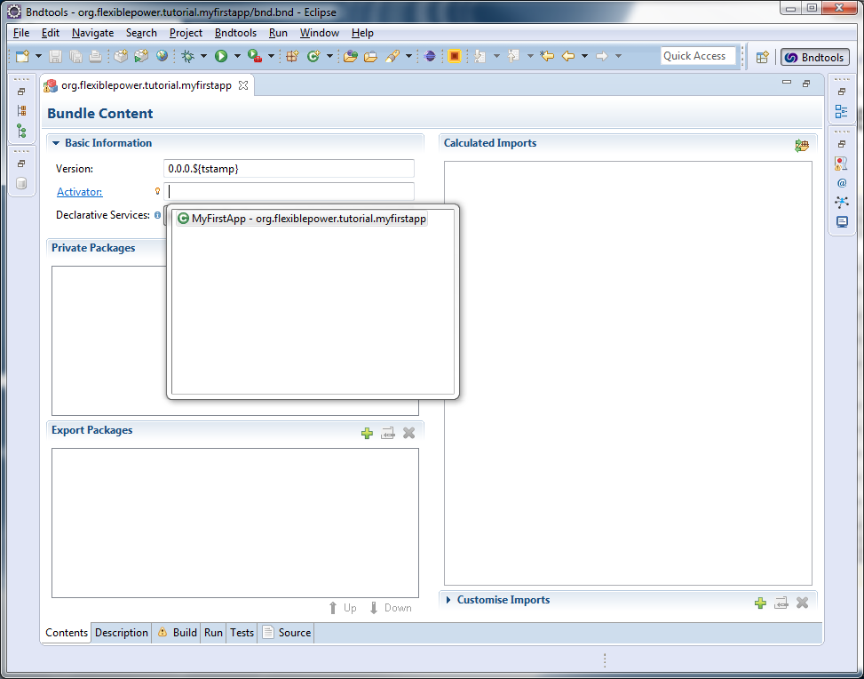
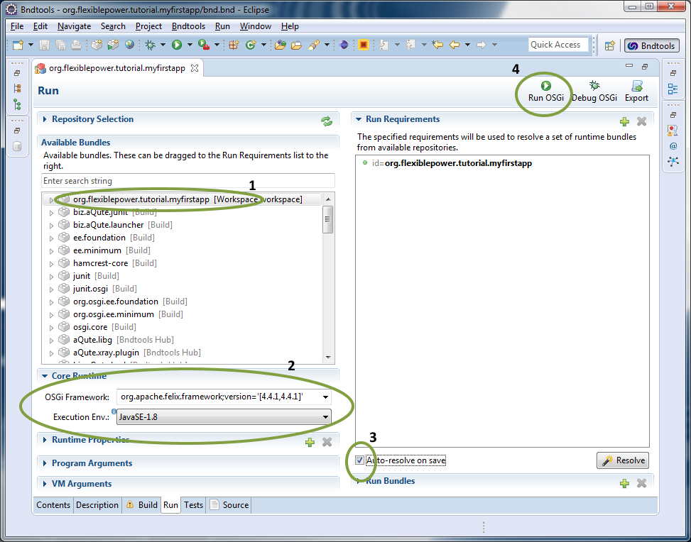
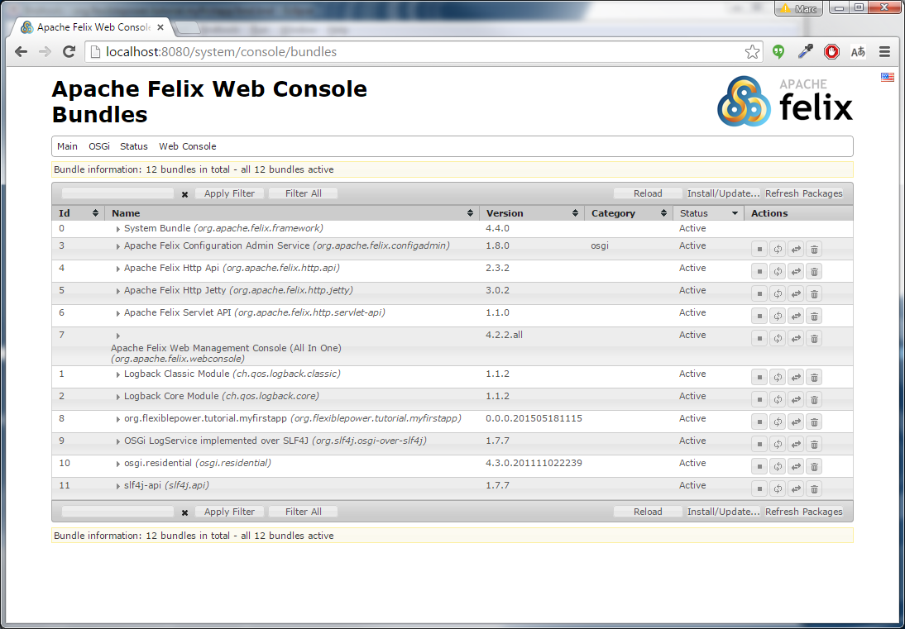
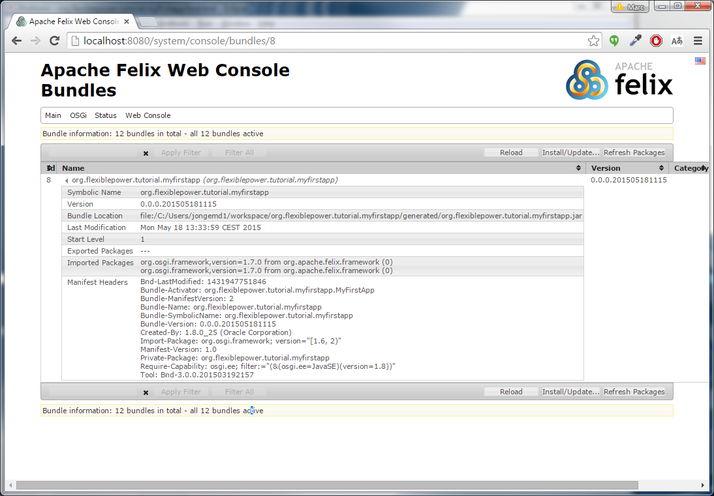

# OSGi Bundles

In OSGi the unit of deployment is called a bundle. In Java terms this a simple a `.jar`-file (a *Java Archive*) with some extra meta data. We'll create our first bundle and run it using Eclipse and bndtools.

## A new bundle

In Eclipse press `File`, `New` and `Bndtools OSGi Project`. This will open up the wizard to start a new project in Eclipse that look like this:



This wizard is very similar to the `New Java Project` wizard with similar options, but the project name is typically also the bundle symbolic name. This name is used to reference it in repositories and should typically contains (part of) a namespace. This should be similar to the base package name that we are going to create. For this example, you can use `org.flexiblepower.tutorial.myfirstapp` and leave the rest of the options as-is. Press `Next` to go to the second page:



On this page you can select a template that makes it quicker to start development, but for the use of this tutorial we will select the `Empty Project`. Press `Next` to go to the final page, which contains the default Java project settings. These should not be changed and you can press `Finish`. This will create the project and open up the bnd.bnd file automatically:



In this view you already see that there is a default version generated of `0.0.0.${tstamp}`. This last part is a bnd *macro* that will be replaced by bnd with the timestamp at the time of the build. And since bndtools adds a build-step to the Eclipse building cycle, there is already a build bundle file available in the project under the `generated` folder. Open this jar file with the `JAR editor` and you will see the following:


Currently the bundle is very empty and only contains the `MANIFEST.MF` file. This file contains the most of the meta data that is relevant for OSGi. The field that are generated now are:

- **Manifest-Version** is always `1.0` and is mandatory for any JAR file in Java.
- **Bnd-LastModified** is a header that bnd adds, but it is not used in OSGi (just convenient for the developer to know the exact version).
- **Bundles-ManifestVersion** is the version of the manifest that OSGi uses. Since OSGi 4 version `2.0` is used and when this is missing version `1.0` is implied. Without this, many new OSGi additions will probably not work.
- **Bundle-Name** is the name of the bundle that will be shown in management tools. It is a textual identifier that may contain any characters and should be unique. By default it is the same as the **Bundle-SymbolicName**, but it can be changed by adding this to the `bnd.bnd` file.
- **Bundle-SymbolicName** and **Bundle-Version** together make the unique identifier for this bundle. The BSN often takes the form of a reverse domain name (like we talked about earlier) and is now generated from the project name. The **Bundle-Version** makes sure you can release several versions of the same bundle and OSGi makes use of semantic versioning. It should always be in the *major.minor.micro.qualifier* format. Later on it the tutorial we will talk in more detail about semantic versioning.
- **Created-By** shows you the version of the java compiler that is used. Mainly for convenience for the developer during debugging.
- **Tool** shows the tool and version that is used to package the bundle. Mainly for convenience for the developer during debugging.

## The first code

Since the bundle is empty, no real code is available and thus the bundle will not do anything when loaded. Lets start by creating a `BundleActivator` that will be called when the bundle is started and stopped. Before we can do this, you need to add the `osgi.core` as a dependency to the project. First go back to the bnd.bnd file that you should still have open:



1. Go to the `Build` tab.
2. Click on the green plus to add a bundle to the build path.
3. Look for `osgi.core` in the available repositories.
4. Select the found bundle under the `Build` repository and click on `Add`.
5. Click `Finish` to finally add it to the build dependencies and save the `bnd.bnd` file.

Now bndtools will have made sure that the reference to the jar-file is added in Eclipse (under the `Bnd Bundle Path` classpath) and we can create the first java code.

First create a new package by right-clicking on the `src` folder and select `New`, `Package`. This wizard will use the project name for the default package, which is fine for now. After the package has been created, create a new Java object by right-clicking on the new package and select `New`, `Class`. In this wizard you can give the new object a name (use `MyFirstApp`) and you should add the `org.osgi.framework.BundleActivator` interface to the list of interfaces:



After finishing this wizard a new `.java`-file has been created and opened for you with 2 methods you can fill: the `start` and `stop` methods, which will be called when the bundle is started or stopped. For the first version just print something in each case, such that you will end up with the following code:

```java
package org.flexiblepower.tutorial.myfirstapp;

import org.osgi.framework.BundleActivator;
import org.osgi.framework.BundleContext;

public class MyFirstApp implements BundleActivator {

	@Override
	public void start(BundleContext context) throws Exception {
		System.out.println("MyFirstApp has started");
	}

	@Override
	public void stop(BundleContext context) throws Exception {
		System.out.println("MyFirstApp has stopped");
	}

}
```

Now we have to tell OSGi which class it should use as the bundle activator, so go back to the `bnd.bnd` file, on the `Contents` tab and there is a `Activator` option that you can fill in. Press the `ctrl-space` hotkey to open up the helper that already shows you the newly created class and select this:



As you will see, this will also add the package to the list of `Private Packages`. This means that the given package is only available for this bundle and not for any other bundles. In the next section we will create an API that should be shared and this will add packages that are exported.

## Running OSGi

Now that we have a bundle with some code in it, we can start the OSGi framework with this bundle loaded. Open the `bnd.bnd` file again and go to the `Run` tab:



1. Drag our bundle from the available bundles list to the `Run Requirements` on the right.
2. Select the latest `org.apache.felix.framework` as the OSGi framework implementation and choose the `JavaSE-1.8` execution environment.
3. Check the `Auto-resolve on save` checkbox and save the file (this will perform resolving, which we will get into later on in the tutorial).
4. Now press the `Run OSGi` button to start your application.

Now you should see the console pop up to say `MyFirstApp has started`. This means that the OSGi framework has started, the bundle has been installed and started.

## The Felix Webconsole

To have a better insight into what is happening, we will use the Apache Felix Webconsole to get a better look into the frawework. This can be done easily by adding 2 more run requirements: `org.apache.felix.webconsole` and `org.apache.felix.http.jetty` (which is the HTTP server). After you have saved and have restarted the runtime, you will see a lot of logging messages of Jetty. Now you can go to the webconsole on [http://localhost:8080/system/console](http://localhost:8080/system/console) and get the following view:



Here we can see all the bundles that have been added to the OSGi framework. The bundle with id 0 is always the system bundle (in our case Felix). The bundle with id 8 is our application (we see the `Bundle-Name` in this case). The rest of the bundles are dependencies that bndtools has resolved for us to be able to run Jetty and the Webconsole. When clicking on our own bundle, we get the following view:



Here we can see the generated version and names of the bundles. Also you can see that it automatically imports the necessary package `org.osgi.framework` from the system bundle. In the manifest headers, the description of the needed packages can be seen after the **Import-Package** header. This header is generated by bndtools for us, because it will do code analysis to figure out any external dependency (including version ranges).
