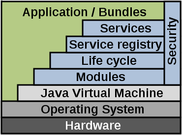

# OSGi

The [Open Service Gateway Initiative](http://www.osgi.org/Main/HomePage) (OSGi for short) is a specification for a service platform in Java. It makes it possible to dynamically load or install pieces of software (OSGi calls the deployment unit a bundle) and provides a lot of basic services that makes it easier for applications to be composed out of smaller software components. It really makes reuse of code much easier.

**Figure: Overview of the OSGi framework**

As can be seen in this image, OSGi runs on a Java Virtual Machine and can be viewed as an operating system for that machine. It handle installation and removal of applications, provides parts to make sure that components can communicate (through a service layer) and it handles security very well. This model has been extended for the FPAI, where we provide more standardized API's and components for easy development of smart energy applications

## This chapter

This chapter will go through the different concepts in OSGi by creating a few demonstration applications for API, using Eclipse and bndtools. The first section will install these tools and setup your environment and the sections after that will step-by-step introduce the different concepts.
