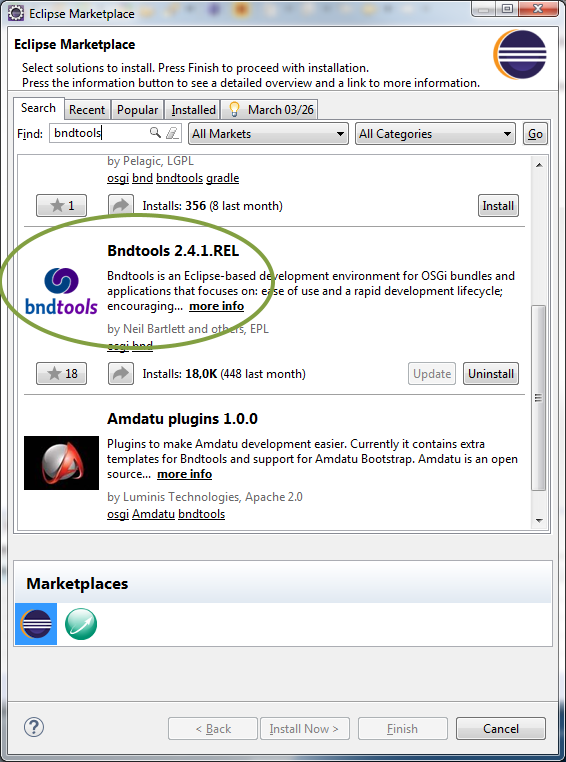
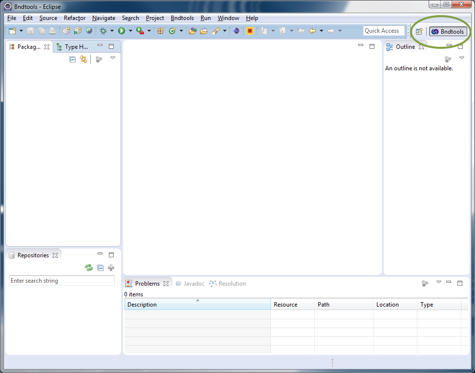
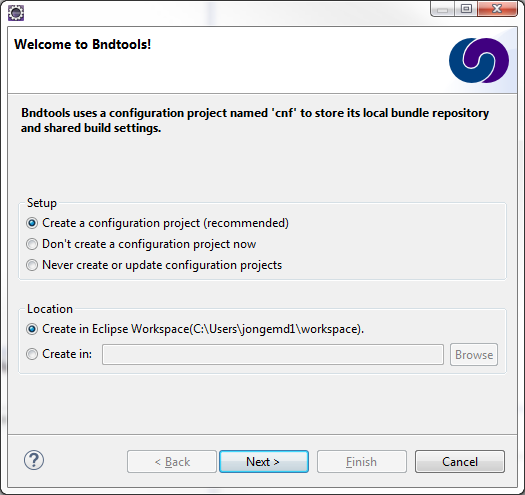
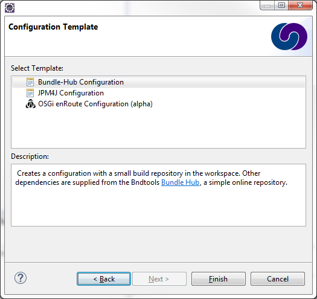
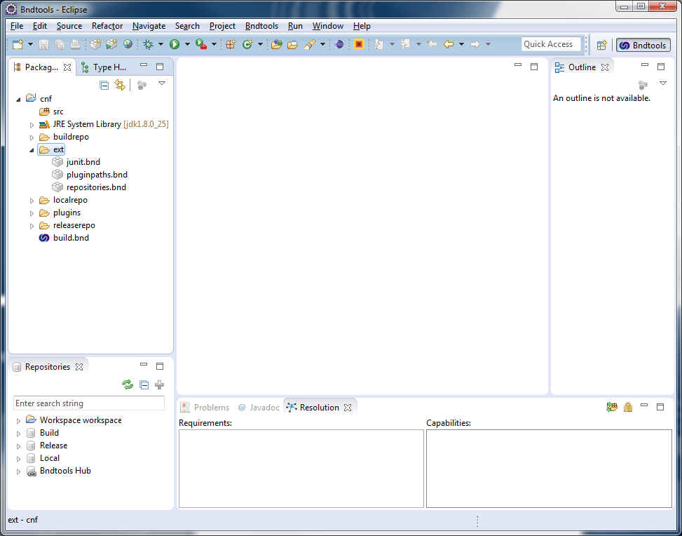

# Setting up your IDE

In this tutorial we will explain how you to set up your development environment for creating OSGi applications.

## Installing the Java Development Kit
First of all, the Java Development Kit (a.k.a. the JDK) needs to be installed. The EF-Pi is developed in Java  version 1.6 (also refered to as version 6), so at least version 1.6 of the JDK needs to be present. Later versions also work fine, so you can just install the latest version for your operating system.

To check if you have installed the JDK you can execute the command `javac -version` on the command line. Windows users can access the command line through Start menu, press Run, type `cmd` and click the OK button. If the JDK is installed you should see the version number. If the JDK is not installed you should get a warning indicating that the command could not be found.

Windows and Mac users can download the JDK from [http://www.oracle.com/technetwork/java/javase/downloads/index.html](http://www.oracle.com/technetwork/java/javase/downloads/index.html "Oracle"). Linux users can install Java through their package manager. OpenJDK also works fine. For example, Ubuntu users can install the JDK with the following commands:

```
sudo apt-get update
sudo apt-get install openjdk-7-jdk
```

## Installing Eclipse
The preferred IDE for developing apps for EF-Pi is Eclipse, currently at version Luna. The latest version of Eclipse can be downloaded from [http://www.eclipse.org/downloads/](http://www.eclipse.org/downloads/). The Standard Eclipse distribution or the Eclipse IDE for Java Developers version is preferred. Be careful to select the right version for your platform. Eclipse is provided as a zip archive and it doesn't have an installer. Just extract Eclipse to a location which is convenient for you.

For more information see [http://www.eclipse.org](http://www.eclipse.org "Eclipse website").

## Starting Eclipse
Now it is time to start Eclipes. The first thing Eclipse asks is the location of your workspace. You can select any location where you want to place your project and click OK. 

When Eclipse has started for the first time, it will show you the Welcome page. You can close it. Now you see the empty workspace.

**Tip:** Are you using a lot of workspaces? When Eclipse starts, it asks you which workspace you want to use. Eclipse only remembers the last five workspaces you have used. Once you have opened up a workspace, you can increase this number by going to 'Window', 'Preferences' and than 'General', 'Startup and Shutdown'. Here you can manage the known workspaces and change the number of recent workspaces to remember.

## Installing Bndtools
The Eclipse plugin for bnd, called Bndtools, can be obtained from the Eclipse Marketplace. In Eclipse, go to `Help` and then to `Eclipse Marketplace...`. Search for `bndtools` and click the `Install` button. During installation you will get a warning complaining about unsigned content. You may ignore that warning. After installation, restart Eclipse.

Make sure you are using the official bndtools release as shown in this image:



For more information see [http://bndtools.org](http://bndtools.org). There is also a general tutorial available at [http://bndtools.org/tutorial.html](http://bndtools.org/tutorial.html).

**Tip:** When you are looking for a more extensive documentation of all the options of bnd, take a look at [http://bnd.bndtools.org/](http://bnd.bndtools.org/).

## Switching to the new perspective
When you have restarted Eclipse after the installation, you can switch to the `bndtools` perspective using the perspective button in the top-right of your screen:



This perspective shows you the repositories in the left-bottom corner (which will be explained later), but the rest is similar to the Java perspective.

## Creating the cnf project
Bnd uses a special project named `cnf` where all the workspace-wide properties are set. Here you can add repositories, change bundle settings for all the bundles in your workspace and more. To create it, go to `Window`, `Preferences` and open the `Bndtools` tab. Here you can press the `Check Now` button that checks if the `cnf` project exists and if not, it will ask you to create it.



The first screen gives you the option whether you want to create and where. Just keep the default options and press `Next`.



The second screen gives a few templates out of which you can choose to generate the `cnf` project. Select the `Bundle-Hub Configuration` and press `Finish` to finally create it. After this process is finished and you have close the preferences window, you will see the following view:



In the `cnf` project there are a lot of options to change, and we'll change the remote repository that we'll use. Open up the `cnf/ext/repositories.bnd` file and put the following code in there:

```
-plugin: \
    aQute.bnd.deployer.repository.FixedIndexedRepo;\
        name=FlexiblePower Bundle Hub - Build;\
        locations=https://raw.githubusercontent.com/flexiblepower/bundle-hub/split-repos/build/index.xml;\
        cache=${workspace}/cnf/cache,\
    aQute.bnd.deployer.repository.FixedIndexedRepo;\
        name=FlexiblePower Bundle Hub - Run;\
        locations=https://raw.githubusercontent.com/flexiblepower/bundle-hub/split-repos/run/index.xml;\
        cache=${workspace}/cnf/cache,\
    aQute.bnd.deployer.repository.FixedIndexedRepo;\
        name=FlexiblePower Bundle Hub - Test;\
        locations=https://raw.githubusercontent.com/flexiblepower/bundle-hub/split-repos/test/index.xml;\
        cache=${workspace}/cnf/cache,\
	aQute.bnd.deployer.repository.LocalIndexedRepo;\
	    name=Local;\
	    local=${workspace}/cnf/localrepo;pretty=true,\
	aQute.bnd.deployer.repository.LocalIndexedRepo;\
	    name=Release;\
	    local=${workspace}/cnf/releaserepo;pretty=true

-releaserepo: Release
```

This makes sure that you use our bundle repository with the latest Apache Felix and Jetty bundles. Also there is a local repository that you can use to add your own bundles in the project.

## Next section

In the next section we will look into the concept of a bundle and create our first application.
