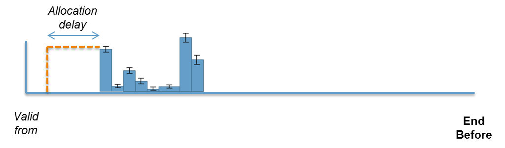
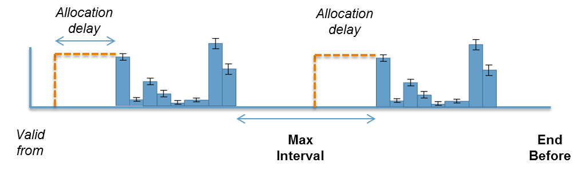
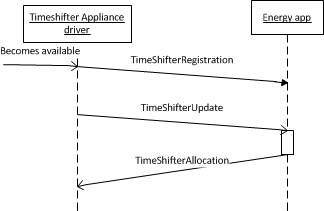
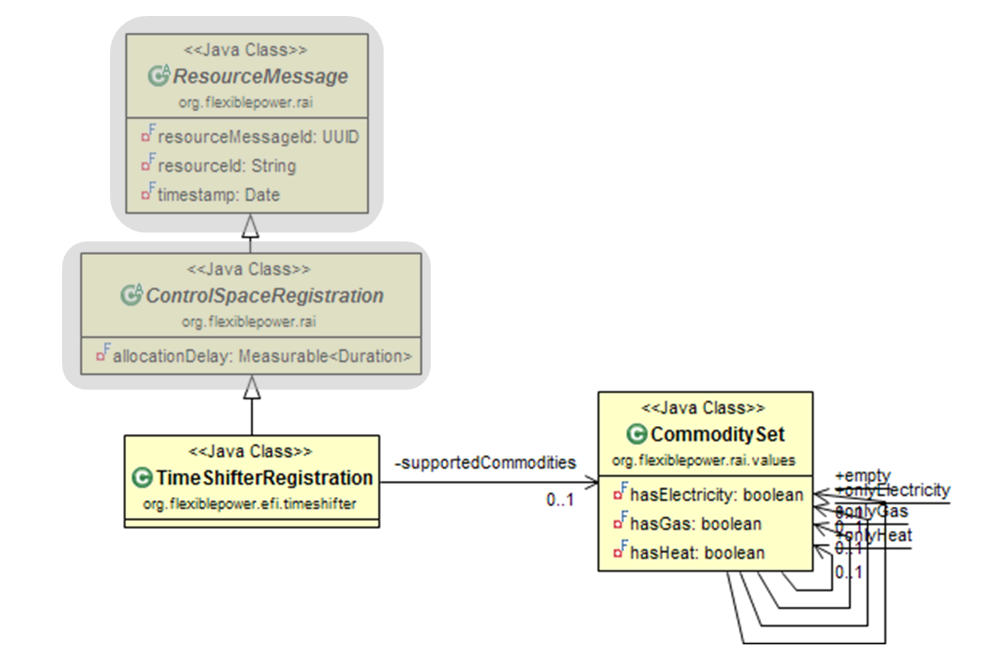
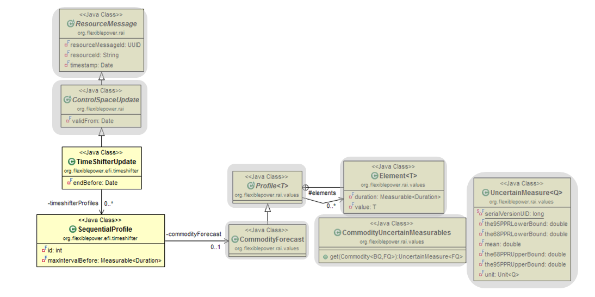
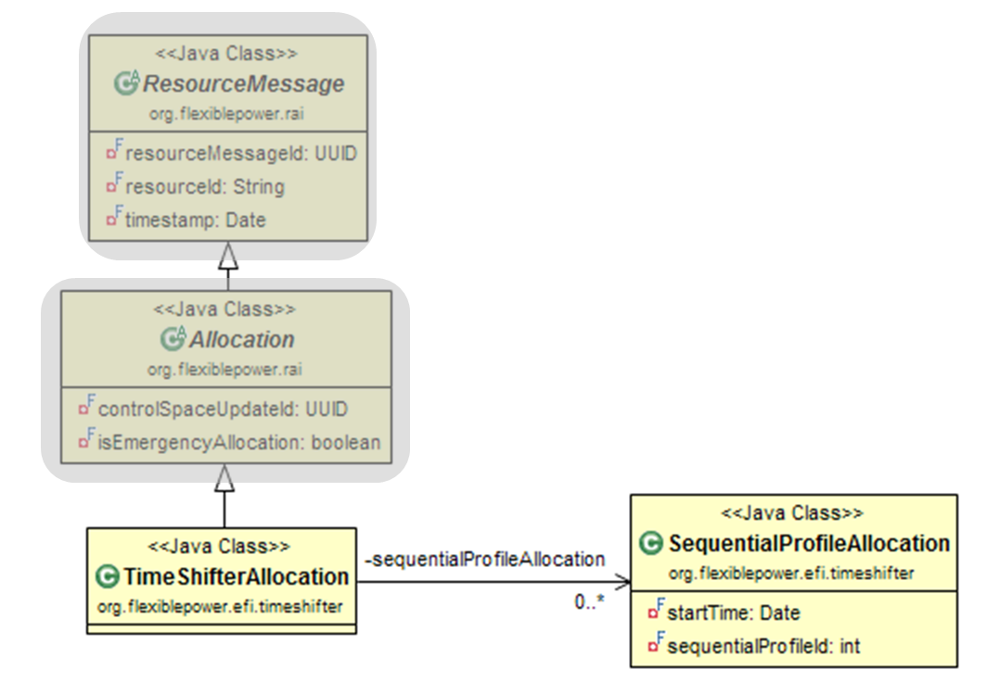

# Timeshiftable EFI

A time shiftable appliance is an appliance which can run a program in a certain time window. The program can be scheduled by an energy service with the only requirement that it is finished by a given deadline. White goods are typical examples of appliances which can adopt this time shiftable behaviour.

Examples Appliances: Dishwasher, Washing machine, Tumble Dryer, Industrial Heater

A time shiftable control space can comprise one or more sequential commodity profiles. Furthermore it has a start time (Valid From) and an end time (End Before) this defines the time window in where the commodity profile(s) can be allocated. The parameter allocation delay represents the physical switch latency of the modelled device.

If there is more than one sequential commodity profiles, it is possible to define a maximum time between the execution of the commodity profiles by assigning a value to the parameter Max Interval.

## Data Elements
This section contains a description for each data element that parameterises the time shifter EFI. The first three subsections contain a UML representation and a parameter description of the three messages: registration, update and allocation message.

Finally two examples on how to use the time shifter EFI are provided.

### Time Shifter Control Space Registration Message
To register an time shifter appliance driver to an energy service the time shifter control space registration message is used. The following figure represents the data elements of an time shifter control space registration message.

#### TimeShifterRegistration
The `TimeShifterRegistration` contains information about the commodities supported by the appliance.

Attribute | Description
--- | ---
`supportedCommodities` | This attribute contains information on the commodities that can be produced or consumed by the appliance. It is of the type `CommoditySet`.

*Table 22: Attribute descriptions of the `TimeShifterRegistration` class.*

#### CommoditySet

This class is derived from `AbstractSet<Commodity<?, ?>>`.

It is a utility class that efficiently stores which `Commodity` instances are in this set. It does not store real references, but instead keeps track of them using boolean values.

Attribute | Description
--- | ---
`hasElectricity` | This `boolean` indicates whether this appliance consumes or produces electricity.
`hasGas` | This `boolean` indicates whether this appliance consumes or produces gas.
`hasHeat` | This `boolean` indicates whether this appliance consumes or produces heat.

*Table 23: Attribute descriptions of the `CommoditySet` class.*

### Time Shifter Control Space Update Message

If a new program is scheduled by time shifter appliance the appliance driver sends a time shifter control space update message towards the energy app. The following figure represents the data elements of an time shifter control space update message.

#### TimeShifterUpdate
When a time shifter has a new program that can be allocated it sends a `TimeShifterUpdate` containing the consumption/production information represented in a list of `SequentialProfile` together with an end time (`endBefore`) and a `startTime` (`validFrom` in `ControlSpaceUpdate`).

Attribute | Description
--- | ---
`endBefore` | The moment in time where every sequential profile in the `timeShifterProfiles` list must be finished.
`timeShifterProfiles` | A list of `SequentialProfile` representing one or more energy profiles (note that this is not being forced in the class definition, hence the zero in the figure), in a CommodityForecast object, that can be allocated sequentially. The forecast profile is used because there can be an uncertainty in the declared profiles. (e.g. the program a tumble dryer controlled by a sensor does not have a fixed duration and therefore some uncertainty)

*Table 24: Attribute descriptions of the `TimeShifterUpdate` class.*

#### SequentialProfile
A `SequentialProfile` is typically used by a time shifter appliance driver to indicate the indicate the order of multiple commodity profiles.

Attribute | Description
--- | ---
`id` | Unique identifier to identify the sequential profile.
`maxIntervalBefore` | The maximum time between the end of the last `SequentialProfile` and the start of this `SequentialProfile`. See Figure 18. The `maxIntervalBefore` of the first sequential profile is typically 0.
`commodityForecast` | This attribute is of the type `CommodityForecast` and contains the actual profile information for each relevant commodity.

*Table 25: Attribute descriptions of the `SequentialProfile` class.*

### Time Shifter Allocation Message
When an energy app allocates the energy flexibility of a time shifter it sends a time shifter allocation message to the appliance driver. The following figure represents the data elements of an time shifter allocation message.

#### TimeShifterAllocation
A `TimeShifterAllocation` consists of a list containing one or more `SequentialProfileAllocations`. This enables the allocation of one or more `SequentialEnergyProfiles`. Which means that the application sending the `Allocation` has the freedom to allocate every `SequentialProfile` individually or more at once.

Attribute | Description
--- | ---
`sequentialProfileAllocation` | A list containing one or more `SequentialProfileAllocations`.

*Table 26: Attribute descriptions of the `TimeShifterAllocation` class.*

#### SequentialProfileAllocation

With a `SequentialProfileAllocation` a `SequentialProfile` can be allocated, therefore it contains a start time and the id of the allocated profile.

Attribute | Description
--- | ---
`sequentialProfileId` | The unique id of the sequential profile that is allocated.
`startTime` | The start time of allocation.

*Table 27: Attribute descriptions of the `SequentialProfileAllocation` class.*

## Time Shifter EFI Examples

This section provides two examples on how to use the time shifter EFI. In the first example the use of a single commodity profile is explained while in the second example the use of multi sequential commodity profiles is explained.

### Washing Machine Example

A washing machine can be a modelled as a time shifter if the machine supports the feature to delay the start of a program and the start can be externally triggered.

In the following sections we describe how an instance of a time shifter control space registration and update can be composed based on a user’s desire to run a washing program.

#### Washing Machine Control Space Registration

The `TimeShifterRegistration` message (see 4.1.1) communicates to the energy app which commodities are consumed or produced by the appliance. For a washing machine the `Commodity` will typically be Electricity. This can be expressed through the `supportedCommodities` attribute. The message is sent from the appliance driver to the energy app to register the device.

#### Washing Machine Control Space Update

The user selects a program, for instance “Cotton 40”. Once this program is selected the energy consumption profile of the selected program can be determined. This energy profile can now be added to the control space update. To do so, a `SequentialProfile` is instantiated with a `CommodityForecast`. This forecast only contains electrical values.

After selecting the program the user programs the timer of the washing machine to select the latest finish time of the program. This value is added to the control space update `endBefore` time. After programming the latest end time the user interaction is finished. The `validFrom` time of the control space is set to the  current time and the hardware switch latency (the duration between the receiving of the allocation by the appliance driver and the physical start of the appliance) is added to the control space update in the parameter `allocationDelay`. Now the control space update message (see 4.1.2) can be sent from the appliance driver to the energy app.

#### Washing Machine Allocation

When the energy app desires the washing machine to start it sends an allocation message (see 4.1.3) to the washing machine. The allocation consist out of an id which matches the control space id (generated in 4.2.1.1) and the id of the `SequentialProfile` that needs to be followed after the desired `startTime`.

### Washing/Dryer Machine Example

A smart washing/dryer machine combo can be modelled as a time shifter with multiple sequential energy profiles.
In this section we describe how an instance of a time shifter control space can be composed based on a user’s request to run a washing plus drying program.

#### Washing Machine Control Space Registration

The `TimeShifterRegistration` message (see 4.1.1) communicates to the energy app which commodities are consumed or produced by the appliance. For a washing
machine the `Commodity` will typically be Electricity. This can be expressed through the supportedCommodities attribute. The message is sent from the appliance driver to the energy app to register the device.

#### Washing/Dryer Washing Machine Control Space

The user selects a program, for instance “Cotton 40 + Tumble dry”. Once this program is selected the energy consumption profiles of the selected program can be determined. These energy profiles can now be added to the control space update message (see 4.1.2). To do so, one `SequentialProfile` for the washing program and one SequentialProfile for the drying program are instantiated. Both profiles contain a `CommodityForecast` which is only filled with electricity value. The maximum time between washing and drying is added to the `maxIntervalBefore` parameter of the drying programs commodityProfile.

After selecting the program the user programs the timer of the washing machine to select the latest end time of the program. This value is added to the control space `endBefore` time. The `validFrom` time of the control space is set to the  current time and the hardware switch latency (the duration between the receiving of the allocation by the appliance driver and the physical start of the appliance) is added to the control space update in the parameter `allocationDelay`. Now the control space update message (see 4.1.2) can be sent from the appliance driver to the energy app.

#### Washing/Dryer Washing Machine Allocation

When the energy service desires to start one of the sequential commodity profiles it sends an allocation for every `SequentialProfile` towards the washing machine. The allocation consist out of an `controlSpaceUpdateId` which matches the control space id (generated in 4.2.1.1) and the `sequentialProfileId` of the `SequentialProfile` that needs to be followed after the desired `startTime`.  If the energy apps desires to allocate multiple `SequentialProfiles` at once it sends a list of `SequentialProfileAllocation` to the appliance driver.
